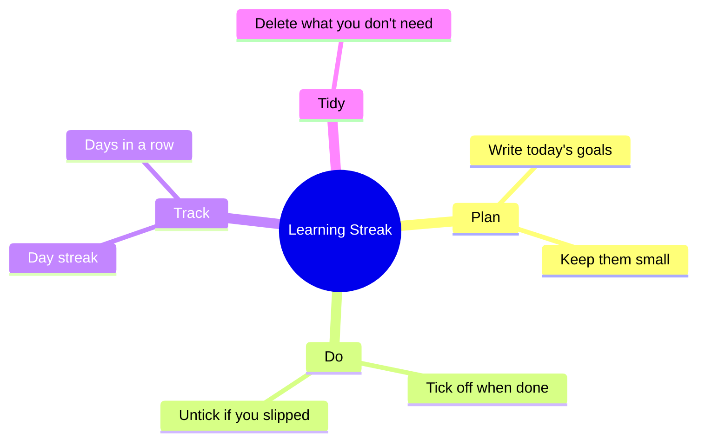

<h1 align="center">🔥 Learning Streak Tracker</h1>

<p align="center">
  <b>Show up a little every day. Tick off what you learned.</b><br>
  A tiny tracker to keep the habit of learning going, one day at a time.
</p>

<p align="center">
  <a href="https://mouparnachowdhury.github.io/Learning-Streak-Tracker/"></a>
</p>

<p align="center">
  
  
  
  
  
</p>

---

## 💭 About

I'm a CSE student just getting started, and I noticed the hardest part of learning is not the hard topics, it is showing up every single day without skipping. So I made this little tracker to keep myself honest.

You write down what you want to learn today, tick things off as you finish them, and the app keeps a streak of how many days in a row you actually showed up.

**Try it live:** https://mouparnachowdhury.github.io/Learning-Streak-Tracker/

<!--
  📸 SCREENSHOTS: add a screenshot here to make the repo pop.
  Put an image in a /screenshots folder and link it like:
  
-->

---

## ✨ What it does

- Add things you want to learn today
- Tick them off when done, or untick if you made a mistake
- Delete anything you do not need
- Keeps a **day streak** of how many days in a row you showed up
- Saves everything in your browser, so your streak is there when you come back

---

## 🗺️ At a glance



---

## 🧱 Built with

- HTML for the structure
- CSS for a clean, simple look
- JavaScript for the tasks and streak logic
- Browser `localStorage`, so your streak survives closing the tab

No frameworks. This was about learning the basics by building something I would actually use.

---

## 🌳 Project structure

```text
learning-streak-tracker/
├── index.html      # the app
├── style.css       # styles
└── script.js       # tasks, streak, and storage logic
```

> Adjust the file names above to match your actual files.

---

## ▶️ How to run it

You can just open the live link above, or run it yourself:

1. Download or clone this repository.
2. Open `index.html` in any web browser.
3. Add today's learning goals and start your streak.

---

## 🌱 Ideas for later

- A small calendar view of your streak
- A gentle nudge on days you have not checked in
- Longest-streak record to beat
- Categories or tags for what you are learning

---

<p align="center"><i>Built by Mouparna while learning to code 🌱</i></p>
